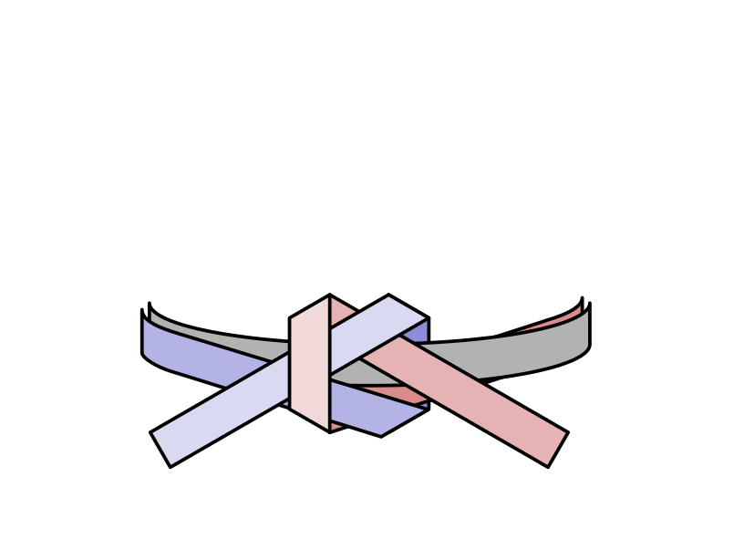

# SVG Simple Images

This project is used to publish SVG images that I created for myself, but might be useful for others.
Most of images are created using [Inkscape](https://inkscape.org/).

Since I believe SVG is a kind of code, [MIT License](LICENSE) is applied to all contents in this page.

## List of SVG

|Image|Title|
|:----|:----------|
||Rotate 90|
||Rotate 90x2|
||Cloud shaped frame||
||Cloud Icon|
||Giteki Mark (技適マーク), which follows [standard](https://www.tele.soumu.go.jp/j/sys/equ/tech/gitekimark/index.htm).|
||Diagram which shows how to tie Obi for Aikido. Data includes hidden layer which shows other steps of tying it.|
||Diagram which shows tied Obi.|

## Test for Local Pages

* [Test](docs/test.html) - other markdown file seems to be converted automatically.

---
